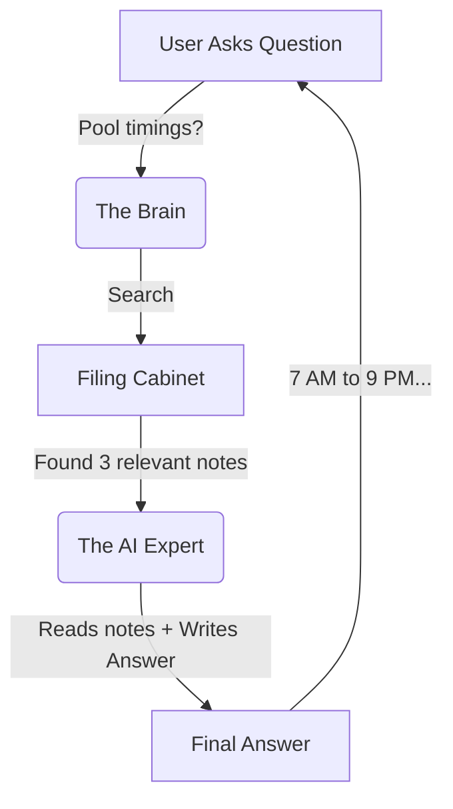

# 🧠 The Brain of O.T.T.O (Dimagh Kaise Kaam Karta Hai)

**Understanding the AI Magic in Simple Terms**

---

## 🤖 The Core Concept (Asli Raaz)

Imagine **O.T.T.O** is not a robot, but a **Super Librarian** (Ek Bahut Hoshiyar Librarian).

### The Problem (Mushkil)
Hamari society ki information **33 different books** (documents) mein bikhri hui hai.
- Agar aapse koi puche "Pool charges kya hain?", to aapko saari kitaabein khol kar dhoondna padega.
- Ismein **bahut waqt** lagta hai!

### The Solution (Hal)
O.T.T.O ka "Brain" is problem ko **3 steps** mein solve karta hai.

---

## ⚙️ How It Works (Kaam Karne Ka Tareeqa)

Is process ko **RAG** kehte hain (Retrieval Augmented Generation), lekin hum isay **"Search & Speak"** kahenge.

### Step 1: reading & Memorizing (Padhna aur Yaad Rakhna)
*(This happens in `brain.ipynb`)*

Isse pehle ke O.T.T.O kisi sawal ka jawab de, usay sab kuch parhna parta hai.

1.  **Reading:** O.T.T.O saari 33 files (Rules, fines, timings) ko parhta hai.
2.  **Chopping:** Wo har page ko chote chote tukdon (chunks) mein kaat leta hai.
    *   *Analogy:* Jaise hum book ke important paragraphs ko highlighter se mark karte hain.
3.  **Filing:** Wo in tukdon ko ek **Special Filing Cabinet** (Vector Database) mein rakhta hai.
    *   Magar wo alphabetical nahi, **Meaning** ke hisaab se rakhta hai!
    *   "Swimming" aur "Pool" wale papers ek saath rakhe jate hain.

### Step 2: Listening & Searching (Sunna aur Dhoondna)
*(This happens when you ask a question)*

Jab aap puchte hain: *"Guest entry ka kya rule hai?"*

1.  **Understanding:** O.T.T.O samajhta hai ke aap "Guest" aur "Entry" ke baare mein puch rahe hain.
2.  **Fast Search:** Wo apni **Special Filing Cabinet** mein jaata hai aur sirf wo pages nikalta hai jahan "Guest" ka zikar ho.
    *   Wo puri library nahi छानta, sirf kaam ke 3-4 pages nikalta hai.

### Step 3: Answering (Jawab Banana)
*(This is the AI Magic)*

Ab O.T.T.O ke paas 2 cheezein hain:
1.  **Aapka Sawal:** "Guest entry rule?"
2.  **Cheat Sheet:** Wo 3-4 pages jo usne abhi nikale.

Ab wo ek **Language Expert** (LLM - Llama 3.3) ko kehta hai:
> "Ye lo information (Cheat Sheet), aur is information ko parh kar is user ke sawal ka jawab do."

Aur result? Aapko ek perfect, complete jawab milta hai! ✨

---

## 🧪 The "Brain" Components (Dimagh Ke Hissay)

Agar hum O.T.T.O ka "X-Ray" karein, to humein ye milega:

| Component | Scientific Name | Simple Name | Kaam Kya Hai? |
|-----------|-----------------|-------------|---------------|
| **Document Loader** | `DirectoryLoader` | **The Reader** | Saari files ko open karke parhta hai. |
| **Text Splitter** | `RecursiveCharacterTextSplitter` | **The Scissor** | Lambe paragraphs ko chote pieces mein kaatta hai. |
| **Embeddings** | `HuggingFace Embeddings` | **The Translator** | English words ko numbers mein convert karta hai taake computer samajh sake. |
| **Vector Store** | `ChromaDB` | **The Cabinet** | Saari information ko organize karke store karta hai. |
| **LLM** | `Groq (Llama 3.3)` | **The Speaker** | Information ko parh kar insano wali zaban mein jawab deta hai. |

---

## 🎨 Visualizing the Process

---

## ❓ Why is this "Smart"? (Ye Hoshiyar Kyun Hai?)

Normal search (Ctrl+F) sirf words match karta hai.

**Normal Job:**
- Search: "Car"
- Result: Sirf wo lines jahan "Car" likha ho.

**O.T.T.O Brain:**
- Search: "Gadi" (Urdu/Hindi word for Car)
- Result: Wo lines jahan "Vehicle", "Parking", "Automobile" likha ho.

**Kyun?** Kyunki ye **Meaning** samajhta hai, sirf spelling nahi!

---

## 🧠 Summary

O.T.T.O ka dimagh **3 kaam** karta hai:
1.  Pehle se sab parh kar rakhna (**Indexing**)
2.  Sawal aane par sahi page nikalna (**Retrieval**)
3.  Us page ko parh kar jawab dena (**Generation**)

Isliye ye kabhi ghalat baat nahi karta - ye hamesha **Suboot (Proof)** ke saath baat karta hai! 🕵️‍♂️
